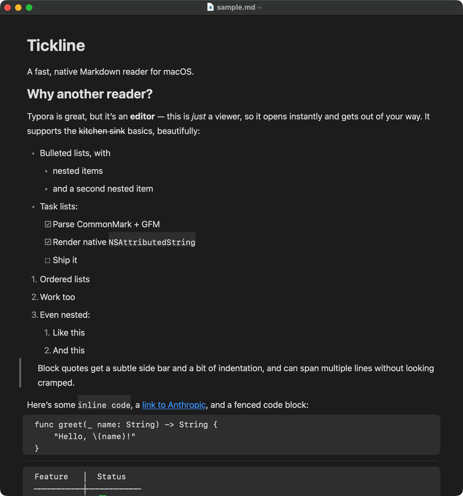

# Tickline

A fast, native Markdown *reader* for macOS — like Typora, minus the editor.



## What it does

- Renders CommonMark + GFM (tables, task lists, strikethrough) into a native
  `NSAttributedString` — no WebKit, no JavaScript, no bundled Chromium.
- Opens fast: it's just AppKit text rendering, so cold launch is well under
  a second.
- Sets itself as the default app for `.md` / `.markdown` / `.mkdn` files.
- Light/dark appearance toggle (toolbar button or the Appearance menu),
  independent of your system setting — defaults to light.

It intentionally doesn't edit or save — it's a viewer, not an IDE.

## Install

### Option 1: download the app

Grab the `.dmg` from the [latest release](https://github.com/nyluke/tickline/releases/latest),
open it, and drag Tickline into Applications.

Tickline isn't notarized (no Apple Developer Program membership behind
this project), so Gatekeeper will refuse to open it with a plain
double-click the first time. Instead: **right-click (or Control-click)
Tickline.app → Open**, then confirm in the dialog that appears. After
that, it opens normally. You'll also want to set it as the default
`.md` handler yourself: right-click a Markdown file → Get Info → "Open
with:" → Tickline → **Change All...**.

### Option 2: build from source

Requires the Swift toolchain (Xcode or just the Command Line Tools) and
[Homebrew](https://brew.sh) for [`duti`](https://github.com/moretension/duti)
(used to set the default file handler; the script falls back to printing
manual instructions if `duti` isn't installed).

```sh
git clone https://github.com/nyluke/tickline.git
cd tickline
./Scripts/install.sh
```

This builds a release binary, assembles `Tickline.app`, ad-hoc code-signs
it, installs it to `/Applications`, and sets it as the default handler for
Markdown files automatically — no Gatekeeper prompt, since it's built
locally rather than downloaded.

Other scripts: `./Scripts/build-app.sh` just builds `build/Tickline.app`
without installing it; `./Scripts/make-dmg.sh` packages a release `.dmg`.

## How it's built

No Xcode project — just [Swift Package Manager](Package.swift) and a
hand-written `Info.plist`. [`swift-markdown`](https://github.com/swiftlang/swift-markdown)
parses the document; a `MarkupVisitor` (`Sources/Tickline/MarkdownRenderer.swift`)
walks the tree and builds a styled `NSAttributedString`, which a custom
`NSTextView` (`Sources/Tickline/MarkdownTextView.swift`) renders, drawing the
full-width code block cards and block-quote bars itself since
`NSAttributedString.backgroundColor` only paints behind glyphs.

## Known limitations

- Tables render as an aligned monospace grid rather than a real ruled
  table — good enough to read, not fancy.
- Remote (`http`/`https`) images show as a clickable link rather than
  loading inline, to keep launch fast and dependency-free.
- `.mdown` / `.mkd` extensions are owned by Typora's own file type on
  systems that have it installed, so they aren't remapped to Tickline.
